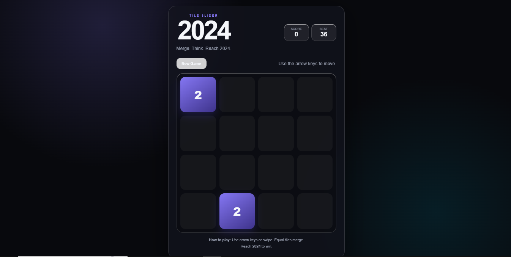

# 2024 - TILE SLIDING GAME
 
Hi! I am Hrishikesh, a curious mind.this is a small recreation of a game where i tried to win but i couldn't. its the famous 2024 game where the goal is to reach **2024** by merging the same tiles.
This is designed in one of my favourite theme- dark glassmorphism
 
## Description
This is a small recreation of the good old game where the player had to reach the tile 2024 to win by merging the same numbered tiles. its desinged in dark glassmorhism, and is web playable. it suports both pc and mobile
## Screenshots
 

 

 
## Getting Started
 Demo: [https://hrishikesh599.github.io/](https://hrishikesh599.github.io/2024-tile-sliding-game/)
### Dependencies
 
* this is a basic static webpage, nothing to install here!!
* Any basic browser will do the job
 
### Executing program
* if your thinking how to run, just double click the index.html file, that's it
## Help
 
* if you are running it locally, and the font seems off, it might be because you have no internet or it slow, fonts needed to load.
* and if the pages seems of in animation, maybe some setting in your browser might block it, ensure it is not!
 
## License
 
This project is licensed under the MIT License - see the LICENSE.md file for details
 
